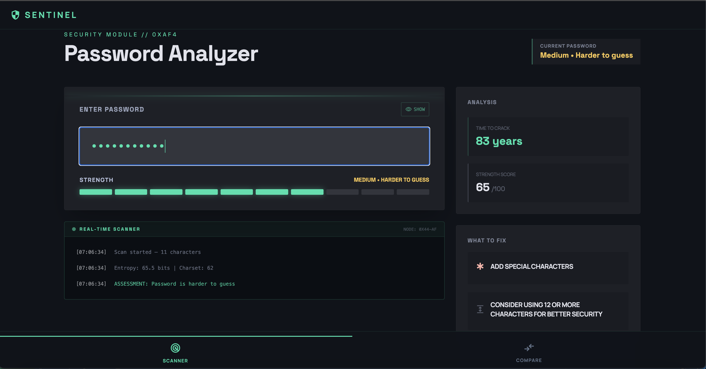
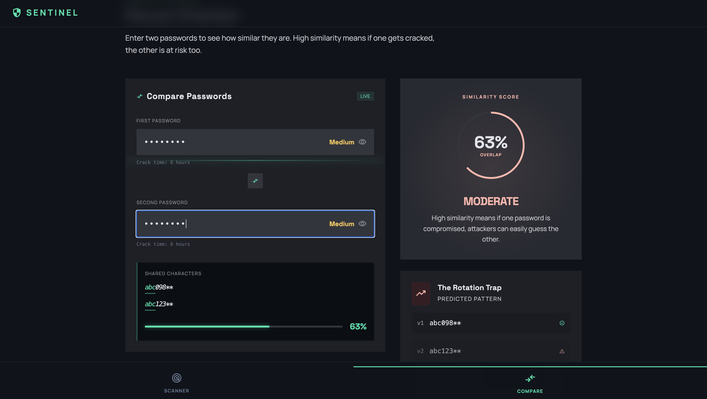

## Description

Aegis Sentinel is a web-based cybersecurity tool designed to analyze password strength, detect common vulnerabilities, and educate users on secure password practices.

The app simulates how attackers evaluate passwords by identifying:

* Weak patterns (e.g., 1234, qwerty)
* Dictionary-based passwords
* Repetition and predictability
* Brute-force vulnerability

It provides real-time feedback, estimated crack times, and actionable recommendations to help users create stronger, more secure passwords.

## Setup Instructions:

Copy and paste the link into your browser

https://marinry.github.io/password-security-app/

## Features:

### Password Analyzer

* Real-time password strength scoring
* Crack time estimation
* Entropy calculation
* Attack type detection (dictionary, brute force, patterns, repetition)
* Live scanner log simulation

### Visual Strength Indicators

* Dynamic strength bar (entropy bars)
* Score out of 100
* Color-coded risk levels

### Smart Feedback System

* Actionable suggestions:
    * Add uppercase/lowercase
    * Add numbers/symbols
    * Increase length
    * Avoid patterns and repetition

    

### Password Comparison Tool

* Compare two passwords
* Similarity percentage
* Risk classification (Low / Moderate / High)
* Pattern prediction 

## Technology Stack

### Frontend:

* HTML5
* CSS (Tailwind)
* JavaScript (jQuery)

### Backend:

* Node.js
* Express.js

### Other:

* AJAX (for real-time analysis)

## Demo

## Future Development Roadmap

* Integration with real password breach databases (HaveIBeenPwned)
* Zxcvbn integration
* Saved password analysis history

## Contact Information

#### Ryan Marin

#### Nathan Karp
Email: n.karp8@gmail.com 
LinkedIn: https://www.linkedin.com/in/nathan-karp-4498713a9